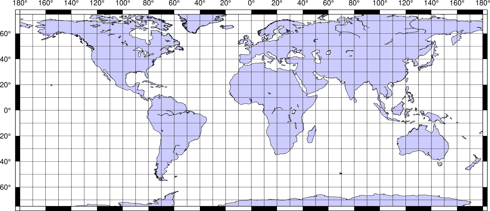

Mapa świata do ćwiczenia współrzędnych geograficznych

Inne wersje tej mapy do pobrania:
* wersja do druku w formacie [PDF](mapy/mapa_swiata_do_wspolrzednych.pdf)

Źródło:
* [skrypt](mapa_swiata_do_wspolrzednych.sh) do programu Generic Mapping Tools
